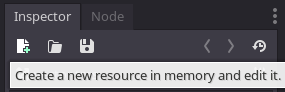
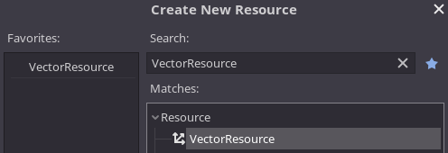
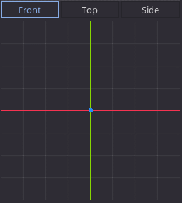

# Godot Vector Resource

A [Godot Engine](https://github.com/godotengine/godot) plugin which introduces a
new `VectorResource` type and an accompanying editor. These allow to store
vectors externally and conveniently edit `Vector2/3` core data types as
regular resources which can be shared between multiple instances.


The plugin provides a way to edit any `Vector2` and `Vector3` by creating and
modifying a `VectorResource`:





Then you can edit the vector visually given the following planes/components: 

* Front/XY
* Top/XZ
* Side/ZY



Normalized (unit) vectors are possible to set with the `snapped` option and 
different `grid_step`, allowing to set unit vectors with different aspect ratios,
and any other vector can be set given its `max_length` starting from origin.

## Using from code

Vector swizzling syntax is used to fetch either `Vector2` or `Vector3` 
representations, as well as individual components.

```gdscript
extends Node

# Loads our previously edited vector resource
export(Resource) var vector = preload("res://vector.tres")

func _ready_():
	print(vector.xy) # prints Vector2(16, 32)
	print(vector.xyz) # prints Vector2(16, 32, 48)

	vector.normalized = true
	vector.xy = Vector2(64, 64)

	print(vector.xy) # prints Vector2( 0.624695, 0.624695 )
	print(vector.xyz) # prints Vector3( 0.624695, 0.624695, 0.468521 )
```
