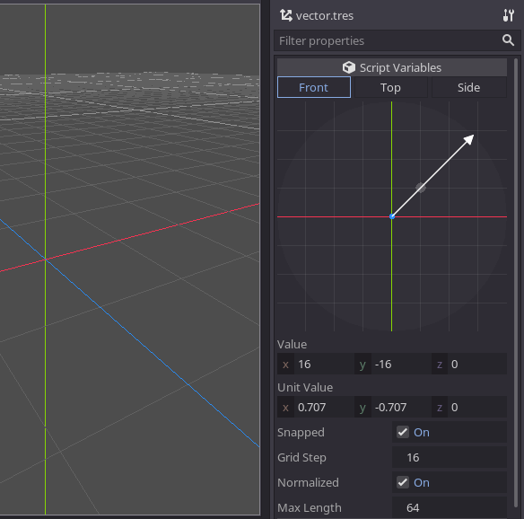

# Godot Vector Resource

A Godot Engine plugin which introduces a new `VectorResource` type and an 
accompanying editor. These allow to store vectors externally and conveniently 
edit `Vector2/3` core data types as regular resources.

The plugin provides a way to edit any `Vector2` and `Vector3` by selected plane: 

* Front (XY)
* Top (XZ)
* Side (ZY)

Normalized (unit) vectors are possible to set with the `snapped` option and 
different grid steps, allowing to set unit vectors with different aspect ratios.
